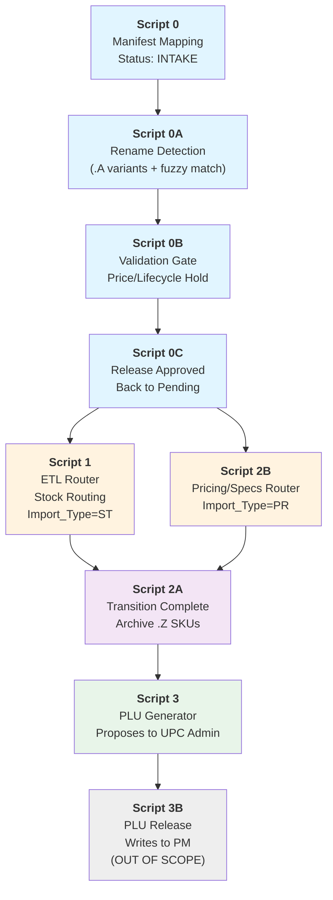

# Script Dependency Map & Overlap Analysis
## Utile PIM V2 — Execution Order & Sequential Enforcement

---

## 1. RECOMMENDED EXECUTION ORDER (Linear Flow)



**Color legend**:
- 🔵 **Blue** = Intake Pipeline (Scripts 0–0C) — Sequential **MUST** run in order
- 🟠 **Orange** = ETL Routing (Scripts 1, 2B) — Can run **in parallel** if filters verified
- 🟣 **Purple** = Transition Cleanup (Script 2A) — Runs after ETL complete
- 🟢 **Green** = PLU Generation (Scripts 3, 3B) — Final stage, single-threaded
- ⚪ **Gray** = Out of scope (3B reference only)

---

## 2. SEQUENTIAL EXECUTION ENFORCEMENT

### Phase 1: Intake Pipeline (MUST BE SEQUENTIAL)

```
┌─────────────────────────────────────────────────────────────┐
│  INTAKE GATE: Scripts 0 → 0A → 0B → 0C (Mandatory Order)    │
└─────────────────────────────────────────────────────────────┘

Script 0:  Manifest ingestion from supplier
   ↓ (writes Staging → SourceMetadata)
   ↓
Script 0A: Identifies rename issues (.A variants + fuzzy matches)
   ↓ (writes SystemLogs + UPCAdmin)
   ↓
Script 0B: Validation gate — holds records needing Nina review
   ↓ (writes SystemLogs + UPCAdmin; sets Staging status = "pending_review")
   ↓
Script 0C: Release approved anomalies back to Staging as "pending"
   ↓ (updates UPCAdmin status = "Resolved"; Staging status = "pending")
   ↓
✅ Ready for ETL routing (Scripts 1 & 2B)
```

**Enforcement**:
- Script 0A starts only if Script 0 completed successfully (check `PENDING` with `IMPORT_TYPE`='ST'/'PR')
- Script 0B starts only if Script 0A completed (check UPCAdmin records exist + notification sent)
- Script 0C starts only if operator approves (Nina's checkbox on UPCAdmin)
- Scripts 1/2B start only after Script 0C completed (check no `"pending_review"` Staging rows)

**Trigger Strategy** (Airtable Automations):
```
When Script 0 completes
  → Wait 30 seconds
  → Trigger Script 0A

When Script 0A completes
  → Wait 5 seconds
  → Trigger Script 0B

When Script 0B completes
  → Send notification to Nina: "Review & approve anomalies in UPC Admin"
  → Wait for manual trigger OR 24-hour auto-release

When approved anomalies exist (UPC Admin checkbox = true)
  → Nina clicks "Release"
  → Trigger Script 0C
  → When 0C completes → Trigger Scripts 1 & 2B in parallel
```

---

### Phase 2: ETL Routing (PARALLEL-SAFE, WITH CONDITIONS)

```
┌──────────────────────────────────────────────────────────────┐
│  ETL ROUTING: Scripts 1 & 2B (Parallel if filters verified)   │
└──────────────────────────────────────────────────────────────┘

Script 1:     Stock routing (IMPORT_TYPE='ST')
   ↓ (reads Staging where IMPORT_TYPE='ST' + ETL_STATUS='pending')
   ↓ (writes SupplierProductData)
   ↓ (sets Staging ETL_STATUS = 'completed')
   ↓

Script 2B:    Pricing/Specs routing (IMPORT_TYPE='PR')
   ↓ (reads Staging where IMPORT_TYPE='PR' + ETL_STATUS='pending')
   ↓ (writes ProductMaster, PricingBridge)
   ↓ (sets Staging ETL_STATUS = 'completed')
   ↓

✅ Both complete in parallel
  (if filters prevent row overlap)
```

**Parallelization Safety Check**:
```
For each Staging row:
  - If IMPORT_TYPE.startsWith('ST') → Script 1 only
  - If IMPORT_TYPE.startsWith('PR') → Script 2B only
  - If both exist for same row → CONFLICT (should not happen)
           Error: "Row has ambiguous IMPORT_TYPE: {type}"

For each row Script 1 processes:
  - Before write: Re-check ETL_STATUS = 'pending' (optimistic lock)
  - If changed, skip row (another script modified it)
  - Log: "Skipped {sku}: status changed to {current_status}"

For ETL_STATUS updates:
  - Script 1 sets 'completed' only if all writes succeeded
  - If batch fails: leave 'pending' so retry can pick it up
```

**Trigger Strategy**:
```
When Script 0C completes
  → Check Staging for PENDING rows
  → If IMPORT_TYPE='ST' rows exist
     → Spawn Script 1
  → If IMPORT_TYPE='PR' rows exist
     → Spawn Script 2B
  → Run both in parallel (Airtable Automations supports concurrent triggers)
```

---

### Phase 3: Transition Cleanup (Sequential after ETL)

```
┌────────────────────────────────────────────────────────────┐
│  TRANSITION: Script 2A (After Scripts 1 & 2B complete)      │
└────────────────────────────────────────────────────────────┘

Script 2A:  Archive old .Z SKUs, activate new .B SKUs
   ↓ (reads ProductMaster for B-flagged + transition links)
   ↓ (creates legacy archive records)
   ↓ (sets .Z status = 'Discontinued')
   ↓ (sets .B status = 'ACTIVE', clears transition link)
   ↓
✅ Ready for PLU generation
```

**Trigger Strategy**:
```
When Script 1 & Script 2B both complete (or Script 2B completes if Script 1 had 0 rows)
  → Check ProductMaster for pending transitions (B-flagged + transition link filled)
  → If count > 0
     → Prompt Nina: "X products ready for transition. Proceed?"
     → On confirm → Trigger Script 2A
  → If count = 0
     → Skip, proceed directly to Script 3
```

---

### Phase 4: PLU Generation (Sequential, Manual Gate)

```
┌────────────────────────────────────────────────────────────┐
│  PLU GENERATION: Scripts 3 → 3B (Manual approval gate)      │
└────────────────────────────────────────────────────────────┘

Script 3:   Proposes PLU codes to UPC Admin (soft writes)
   ↓ (reads ProductMaster for status='PM NEW' + no PLU assigned)
   ↓ (generates codes using body type + supplier SKU logic)
   ↓ (writes proposals to UPCAdmin table)
   ↓ (sends notification: "Review proposals in UPC Admin")
   ↓

🔴 MANUAL GATE: Nina reviews each proposal
   - Ticks "Approved" if correct
   - Sets "Rejected" if wrong (with reason)
   ↓

Script 3B:  Releases approved PLUs to ProductMaster (out of scope)
   ↓ (Trigger: Nina clicks "Release Approved")
   ↓ (reads UPCAdmin where Approved=true + only write approved)
   ↓ (writes SKU_MASTER field on ProductMaster)
   ↓
✅ PLU codes now live on products
```

---

## 3. OVERLAP RISK MATRIX

| Script Pair | Overlap Type | Severity | Risk | Mitigation |
|-------------|--------------|----------|------|-----------|
| **0A ↔ 0B** | Both write UPCAdmin | Medium | Duplicate anomaly records | Enforce 0A→0B sequential order; check UPCAdmin record count doesn't increase unexpectedly |
| **1 ↔ 2B** | Both read Staging, modify ETL_STATUS | **HIGH** | Race condition; row processed twice | Implement optimistic locking (recheck ETL_STATUS before update); use different IMPORT_TYPE filters; test parallelization |
| **2A ↔ 3** | Both depend on PM enrichment complete | Low | Logic order | 2A must complete before 3 (clean up old codes first); automate enforcement |
| **3 ↔ 3B** | 3B writes directly to PM based on 3's proposals | Low | Two-phase design | Intentional (approval gate); no conflict if 3B only writes approved |

---

## 4. SCRIPT-BY-SCRIPT PARALLELIZATION RULES

### Script 0A & 0B: SEQUENTIAL (No Parallelization)

**Reason**: Both detect anomalies for same input and write to same UPCAdmin table.

**Dependency**:
```
0A Output (renames detected)  →  Fed into  →  0B (validates, holds for Nina)
```

**Concurrency Rule**: 
- 0B should not start until 0A's UPCAdmin records are complete
- Check: `COUNT(UPCAdmin WHERE created_today AND Detected_By='0A') > 0`

---

### Script 1 & 2B: PARALLEL-SAFE (With Filters Verified)

**Reason**: Different IMPORT_TYPE filters prevent row overlap.

**Filters**:
```
Script 1:  SELECT * FROM Staging 
           WHERE ETL_STATUS='pending' 
           AND IMPORT_TYPE LIKE 'ST%'

Script 2B: SELECT * FROM Staging 
           WHERE ETL_STATUS='pending' 
           AND IMPORT_TYPE LIKE 'PR%'
```

**Risk**: If a row has `IMPORT_TYPE='STPR'` (both), both scripts will process it.

**Concurrency Rule**:
```
if (row.IMPORT_TYPE matches both 'ST' AND 'PR') {
  throw Error("Ambiguous IMPORT_TYPE: Row {id} cannot be processed by both Script 1 & 2B");
}

BEFORE each script updates ETL_STATUS:
  SELECT current_status = Staging[row_id].ETL_STATUS
  if (current_status !== 'pending') {
    log("SKIPPED: Status changed to {current_status} by other script")
    continue
  }
```

**Parallelization Checkpoint**:
```
Can Script 1 & 2B run in parallel?
  ☑ If IMPORT_TYPE is always purely 'ST' or purely 'PR' per row
  ☐ If mixed IMPORT_TYPE values exist
          → Run sequentially or add conflict detection
```

---

### Script 2A, 3, 3B: SEQUENTIAL (Chained Approvals)

**Reason**: 2A must clean up old codes before 3 generates new ones.

**Dependency**:
```
2A Complete (old .Z archived)  →  3 Generates (new .B codes)  →  3B Releases (approved only)
```

---

## 5. IMPLEMENTATION CHECKLIST

### In Airtable Automations (UI Setup)

- [ ] Create automation: "When Script 0 completes → Wait 30s → Run Script 0A"
- [ ] Create automation: "When Script 0A completes → Wait 5s → Run Script 0B"
- [ ] Create automation: "When Script 0B completes → Notify Nina + Wait for approval"
- [ ] Create automation: "When UPCAdmin approval = true → Run Script 0C"
- [ ] Create automation: "When Script 0C completes → Run Scripts 1 & 2B in parallel"
- [ ] Create automation: "When Script 1 & 2B complete → Prompt for Script 2A trigger"
- [ ] Create automation: "When Script 2A completes → Run Script 3"
- [ ] Create automation: "When Script 3 completes → Notify Nina + Wait for approval"

### In Script Code (Enforcement)

- [ ] **Script 0A**: Add check: `assert(has_pending_st_rows) else log("Run Script 0 first")`
- [ ] **Script 0B**: Add check: `assert(has_upcadmin_from_0a) else log("Run Script 0A first")`
- [ ] **Script 0C**: Add check: `assert(has_approved_anomalies) else log("No approved records; nothing to release")`
- [ ] **Script 1**: Add pre-flight: Compare ETL_STATUS before each update (optimistic lock)
- [ ] **Script 2B**: Same as Script 1
- [ ] **Script 2A**: Add check: `assert(no_pending_b_flags) else log("Run Scripts 1/2B first")`
- [ ] **Script 3**: Add check: `assert(no_pending_transitions) else log("Run Script 2A first")`

### Logging & Monitoring

- [ ] Add script start/end timestamps to SystemLogs
- [ ] Log skipped rows with reason (conflict detected, status changed, etc.)
- [ ] Create dashboard: "Pipeline Flow" showing records at each stage
- [ ] Set alerts: If script takes > 5 minutes, notify admin

---

## 6. TROUBLESHOOTING: "Script X Hung or Failed"

### If Script 0A Never Starts
```
Check:
  1. Script 0 completed? (SystemLogs check)
  2. Is Staging populated with PENDING + ST/PR import types?
  3. Are permissions set? Test: Run Script 0A manually
```

### If Scripts 1 & 2B Both Modified Same Row
```
Recovery:
  1. Check Staging row ETL_STATUS — should be 'completed'
  2. Check SPD & PM tables — look for duplicates or conflicts
  3. Check SystemLogs:
     - If Script 1 won, check PM row
     - If Script 2B won, check SPD row
  4. Manual audit: Which one succeeded? Delete dupe.
  5. Reset row to 'pending', re-run correct script in isolation
```

### If Script 0C Never Released Records
```
Check:
  1. Is UPCAdmin.Approved checkbox actually ticked?
  2. Is UPCAdmin.Resolution_Status = 'Unresolved'?
  3. Check Script 0C logs: Did it find matching SKUs in approvedSkus list?
  4. Check for undefined `alreadyReleased` error (known bug — see Audit Report)
```

---

## 7. FUTURE: Auto-Scaling for High Volume

**Current Design**: Sequential + 1 parallel gate (Scripts 1 & 2B)

**When Volume Grows (>100 pending rows/run)**:
- Consider implementing queue system (Zapier, IFTTT, or Airtable API webhook)
- Partition Staging by supplier, process suppliers in parallel
- Implement database transaction logging for audit trail

---

## Appendix: Script Trigger Configuration Template

**For Airtable Automations UI** (if using native triggers):

```
Trigger Name: "ETL Pipeline Stage: 0A→0B"
When: [Custom action created] (e.g., user clicks "Start Intake")
Actions:
  1. Run Script: Script 0A
  2. Wait: 5 seconds
  3. Run Script: Script 0B
  4. Send notification: Nina@email.com
     Subject: "Validation gate complete — review UPC Admin"
```

---

**Status**: ✅ Ready for implementation  
**Next steps**: Implement automation triggers + code enforcement checks
